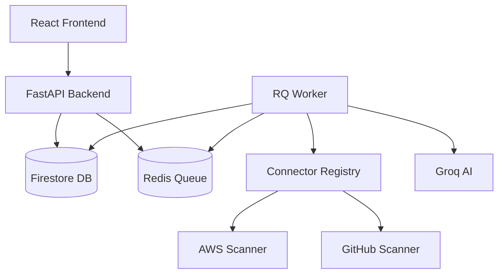

# Architecture Overview

AIXYNZ Cortex is designed as a decoupled, multi-tenant Security Operations Platform. 

## System Context

## Core Patterns

### 1. The Connector Framework
Scanners are decoupled behind a `BaseConnector` interface (`backend/connectors/base.py`). 
The `ConnectorRegistry` initializes connectors dynamically based on an Organization's `integration` configurations. 
To add a new scanner (e.g. Azure), you simply implement `scan()`, `validate()`, `metadata()`, and `health()`, then add it to the registry. No core application logic needs to change.

### 2. Asset-Centric Data Model
Unlike older security tools that treat *findings* as the primary entity, Cortex treats *assets* as the primary entity.
When a finding is ingested, Cortex attempts to extract an `external_asset_id` (e.g., an AWS ARN or GitHub Repo name).
The `asset_service.py` upserts the asset, links the finding to it, and recalculates the asset's overall risk score.

### 3. Background Processing
Long-running operations (like scanning an AWS environment) are handled asynchronously using **RQ** (Redis Queue).
- The `scheduler.py` enqueues jobs dynamically.
- The `/api/v1/scan/rescan` endpoint kicks off jobs immediately.
- A fallback "in-process" execution mode allows developers to test without running a Redis instance.

### 4. Demo Mode vs Live Mode
Cortex abstracts `firebase_client.py` to support two runtime environments seamlessly:
- **Live Mode**: Requires a `serviceAccountKey.json`. Uses Google Cloud Firestore for persistence.
- **Demo Mode**: Triggered automatically if the key file is missing. Uses an in-memory dictionary (`_mock_db`) and mocked scanner results to allow instant evaluation and frontend development without cloud configuration.
